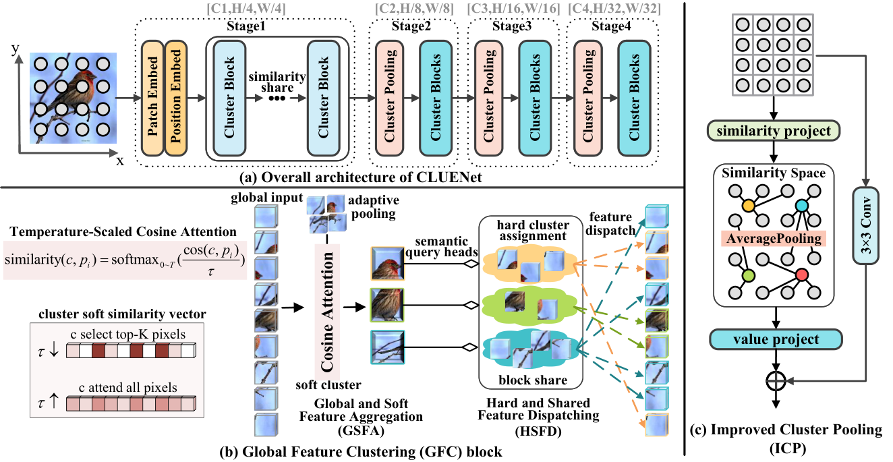
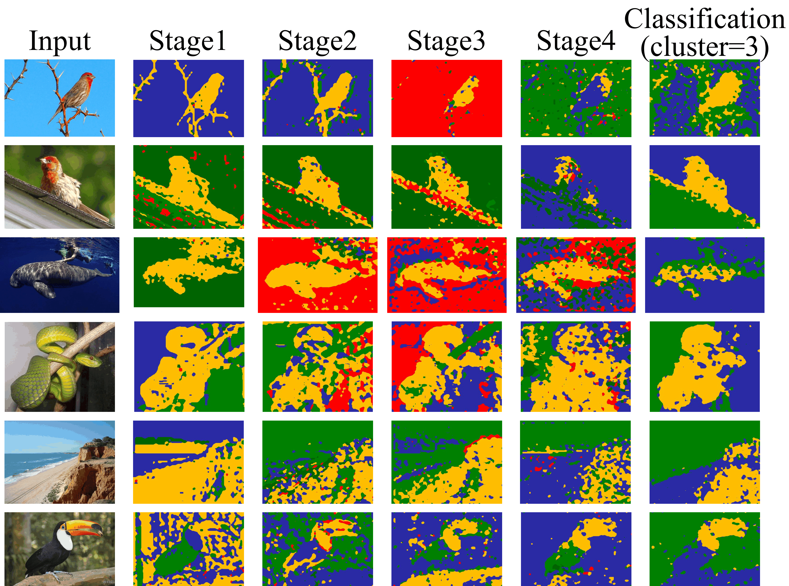
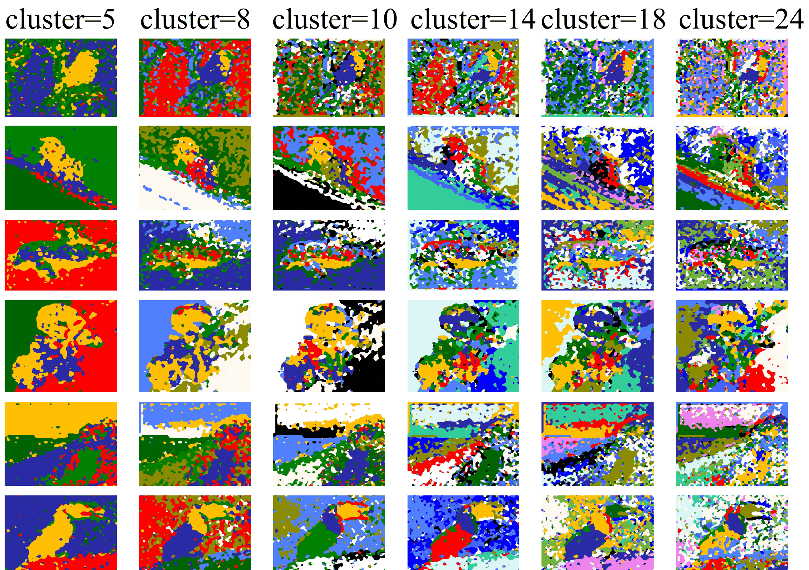
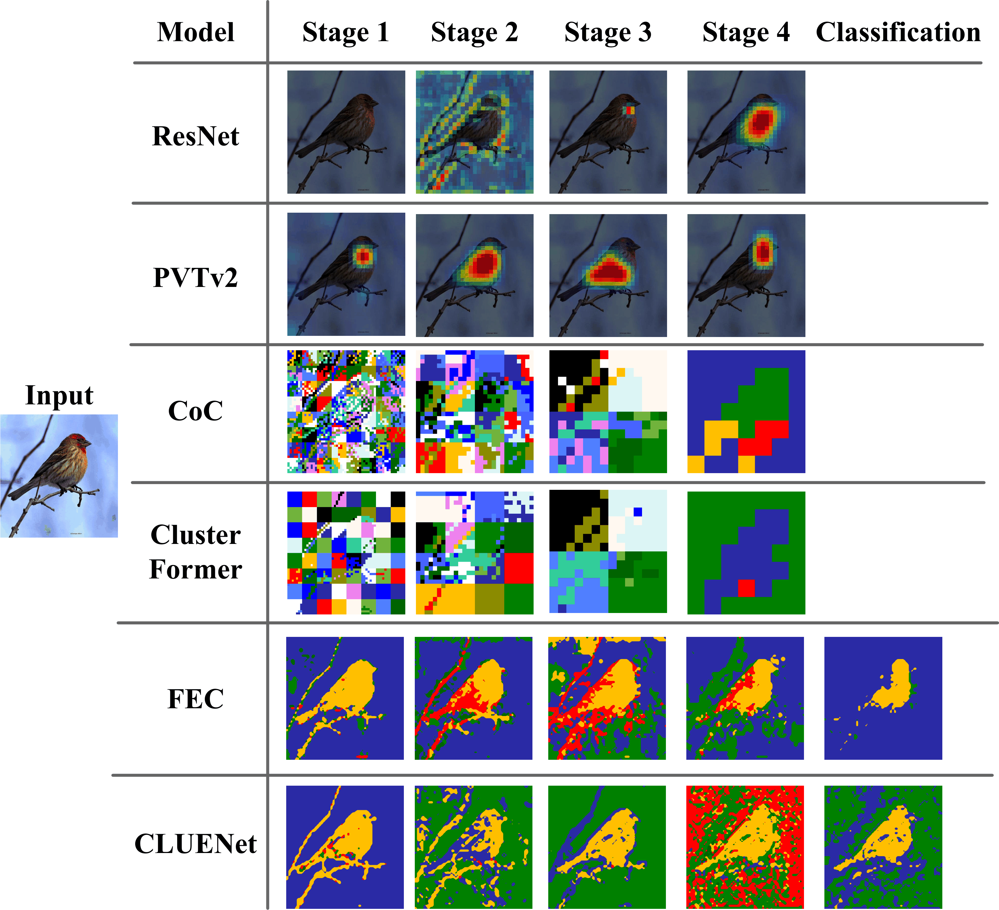

<div align="center">

# CLUENet: Cluster Attention Makes Neural Networks Have Eyes

[](https://arxiv.org/abs/2512.06345)
[](https://ojs.aaai.org/index.php/AAAI/article/view/37867)
[](LICENSE)


**Official PyTorch implementation of the AAAI 2026 paper:**  
*CLUENet: Cluster Attention Makes Neural Networks Have Eyes*

[Xiangshuai Song](https://github.com/52KunKun), Jun-Jie Huang, Tianrui Liu, Ke Liang, Chang Tang

</div>

---

## 🔥 Highlights

Existing clustering-based vision models suffer from three key limitations: **(1)** suboptimal performance relative to state-of-the-art architectures; **(2)** limited receptive field due to local window partitioning with no inter-window communication; **(3)** gradient vanishing in cluster pooling layers, causing frozen parameters and redundancy. CLUENet addresses all three:

- 🌐 **Global Soft Aggregation & Hard Assignment**: Computes global similarities between cluster centers and all pixels to form soft clusters via weighted fusion, supplemented by a gated residual module for local context and a global query head for precise hard pixel assignment.
- ⚡ **Efficient Aggregation with Shared Assignment**: Employs cosine attention with learnable temperature in half-precision via [FlashAttention](https://github.com/Dao-AILab/flash-attention) for fast, memory-efficient aggregation. Hard assignment matrices are shared across blocks within each stage to reduce redundancy and enhance training stability.
- 🔄 **Improved Cluster Pooling**: Performs clustering and pooling in similarity space and projects results back to feature space via a perceptron, effectively alleviating gradient vanishing and boosting performance.
- 🏆 **State-of-the-Art Results**: Achieves **76.55%** Top-1 on CIFAR-100 and **82.44%** Top-1 on Mini-ImageNet, outperforming all clustering-paradigm models and surpassing Conv / Attention baselines at comparable parameter scales.

---

## 🏗️ Architecture

<div align="center">

<br>
<em>(a) Overall architecture of the CLUENet with a four-stage pyramid network; (b) The key components within the Global Feature Clustering (GFC) block, illustrating Global and Soft Feature Aggregation (GSFA) that updates cluster centers from all pixels, and Hard and Shared Feature Dispatching (HSFD) that updates pixel features according to their assigned cluster centers; (c) The Improved Cluster Pooling (ICP) block, depicting how pixel features are grouped into clusters in similarity space while preserving hierarchical structure.</em>
</div>

---

## 📊 Results

> ⚠️ **All results are obtained by training from scratch, without any pretrained weights.**

### CIFAR-100

| Paradigm | Method | #Param (M) | FLOPs (M) | Top-1 (%) | FPS |
|:--------:|--------|:----------:|:---------:|:---------:|:---:|
| Conv | ResNet | 14.16 | 186.21 | 69.84 | 16858 |
| Conv | ConvMixer | 2.78 | 175.88 | 67.21 | **20433** |
| Conv | ShuffleNet | 5.55 | 186.83 | **71.09** | 14660 |
| Conv | MobileNet | 2.37 | 68.43 | 66.62 | 17241 |
| Attn | ViT | 3.22 | 224.12 | 56.93 | 16809 |
| Attn | PVTv2 | 3.43 | 172.88 | **70.77** | 12711 |
| Attn | CPVT | 3.12 | 155.27 | 66.09 | 14885 |
| Attn | Swin | 5.15 | 245.84 | 65.33 | 11496 |
| Cluster | CoC | 2.72 | 161.11 | 71.92 | 10712 |
| Cluster | FEC | 2.83 | 197.12 | 69.73 | 9663 |
| Cluster | ClusterFormer | 2.92 | 173.47 | 66.05 | 8041 |
| Cluster | **CLUENet (ours)** | **3.02** | 188.88 | **76.55** | 7807 |

### Mini-ImageNet

| Paradigm | Method | #Param (M) | FLOPs (G) | Top-1 (%) | Top-3 (%) | FPS | Memory (GB) |
|:--------:|--------|:----------:|:---------:|:---------:|:---------:|:---:|:-----------:|
| Conv | ResNet18 | 14.17 | 2.38 | 76.95 | 89.88 | 1150.75 | 2.7 |
| Conv | ShuffleNetv2 (x1.5) | 2.58 | 0.31 | 78.39 | 90.40 | **1194.72** | **1.1** |
| Conv | ShuffleNetv2 (x2.0) | 6.52 | 0.64 | 79.63 | 90.93 | **1205.17** | **1.3** |
| Conv | ConvNeXtv2 (A) | 3.42 | 0.55 | 71.15 | 84.97 | 1172.04 | 1.6 |
| Conv | ConvNeXtv2 (N) | 15.05 | 2.46 | 75.04 | 87.48 | 1148.19 | 2.8 |
| Attn | PVTv2 (b0) | 3.44 | 0.54 | 75.34 | 88.52 | 1195.32 | 1.7 |
| Attn | PVTv2 (b1) | 13.55 | 2.06 | 77.57 | 89.86 | 1154.58 | 2.9 |
| Attn | EfficientFormer (s0) | 3.26 | 0.40 | 77.92 | 89.71 | 1166.09 | 1.5 |
| Attn | EfficientFormer (s2) | 12.16 | 1.27 | 79.75 | 90.42 | 695.41 | 1.5 |
| Attn | EfficientViT (m5) | 12.13 | 0.52 | 75.32 | 88.03 | 1160.99 | 1.0 |
| Cluster | CoC (tiny) | 5.28 | 1.12 | 74.90 | 88.29 | 887.11 | 2.2 |
| Cluster | CoC (medium) | 28.83 | 5.96 | 78.39 | 90.29 | 605.67 | 4.2 |
| Cluster | FEC (small) | 5.44 | 1.38 | 76.74 | 89.34 | 854.25 | 5.2 |
| Cluster | FEC (large) | 29.26 | 6.55 | 79.33 | 90.55 | 550.69 | 7.6 |
| Cluster | ClusterFormer (tiny) | 30.27 | 5.58 | 73.99 | 88.26 | 588.56 | 9.6 |
| **Cluster** | **CLUENet (micro)** | **3.02** | **0.65** | **78.75** | **90.83** | 871.89 | 4.2 |
| **Cluster** | **CLUENet (tiny)** | **5.68** | **1.30** | **80.51** | **91.29** | 867.76 | 5.5 |
| **Cluster** | **CLUENet (small)** | **15.05** | **3.16** | **81.49** | **92.06** | 878.60 | 6.5 |
| **Cluster** | **CLUENet (base)** | **30.20** | **6.40** | **82.44** | **92.47** | **679.05** | 7.7 |

### Visualization

<div align="center">

<br><br>

<br>
<em>Visualization of (a) the clustering results of semantic heads at each of the four stages, along with the global receptive field map w.r.t. the final classification decision, and (b) the global receptive field map w.r.t. different cluster numbers.</em>
</div>

<div align="center">

<br>
<em>Visualization results of different paradigm models. ResNet shows Grad-CAM activation maps at four stages. PVTv2 presents attention maps based on the center query token in the first attention head of the last block at each stage. CoC, ClusterFormer and FEC visualize one attention head from one block per stage. FEC and CLUENet additionally provide the final-stage semantic clustering maps used for classification.</em>
</div>

---

## ⚙️ Installation

```bash
# Step 1: Clone the repository
git clone https://github.com/52KunKun/CLUENet.git
cd CLUENet

# Step 2: Create conda environment
conda create -n cluenet python=3.9 -y
conda activate cluenet

# Step 3: Install PyTorch (example with CUDA 12.1)
pip install torch==2.1.0 torchvision==0.16.0 torchaudio==2.1.0 --index-url https://download.pytorch.org/whl/cu121

# Step 4: Install other dependencies
pip install timm einops ptflops

# Step 5: Install packages that require compilation
# Both packages provide pre-built wheels — downloading the matching wheel is strongly recommended
# over building from source to avoid long compile times.
#
#   torch_scatter wheels  →  https://pytorch-geometric.com/whl/
#   flash-attn wheels     →  https://github.com/Dao-AILab/flash-attention/releases
#
pip install torch_scatter          # or install from the wheel above
pip install flash-attn --no-build-isolation  # requires CUDA >= 11.6; A100 / V100 recommended
```

---

## 📁 Dataset Preparation

### Mini-ImageNet (100 classes, 60,000 images)

- 📥 Download: [Baidu Pan](https://pan.baidu.com/s/1Uro6RuEbRGGCQ8iXvF2SAQ) &nbsp; Password: `hl31`
- Official page: [mini-imagenet-tools](https://github.com/yaoyao-liu/mini-imagenet-tools)

Extract and organize as follows:

```
mini-imagenet/
├── images/          # 60,000 images
├── train.csv        # 64 classes / 38,400 images
├── val.csv          # 16 classes / 9,600 images
└── test.csv         # 20 classes / 12,000 images
```

### CIFAR-100

- Official page: https://www.cs.toronto.edu/~kriz/cifar.html
- Can be downloaded automatically via `torchvision.datasets.CIFAR100(..., download=True)`.

### CUB-200-2011

- Official page: https://www.vision.caltech.edu/datasets/cub_200_2011/
- 📥 Download: [CUB_200_2011.tgz](https://data.caltech.edu/records/65de6-vt576/files/CUB_200_2011.tgz)

### Food-101

- Official page: https://data.vision.ee.ethz.ch/cvl/datasets_extra/food-101/
- 📥 Download: [food-101.tar.gz](http://data.vision.ee.ethz.ch/cvl/food-101.tar.gz)

### IP102

- Official page: https://github.com/xpwu95/IP102
- 📥 Download: [Google Drive](https://drive.google.com/drive/folders/1svFSy2Da3cVMvekBwe13mzyx38XZ9tfc)

---

## 📦 Pretrained Weights

> All checkpoints are **trained from scratch** — no external pretrained weights are used.

| Dataset | Download | Password |
|---------|:--------:|:--------:|
| CIFAR-100 (all variants) | [Baidu Pan](https://pan.baidu.com/s/1VnHs4CCijqKCdwz4QFSnmQ?pwd=u7bq) | `u7bq` |
| Mini-ImageNet (all variants) | [Baidu Pan](https://pan.baidu.com/s/16exsP-IOLYoWxSW5riq9RA?pwd=dp7a) | `dp7a` |

> Checkpoints for some baseline methods (CoC, FEC, etc.) are also partially available in the corresponding subdirectories.

---

## 🚀 Training

### Mini-ImageNet

```bash
cd test_on_miniDataset/mini_imagenet

python train_single_gpu.py \
    --model CLUE_tiny \
    --num_classes 100 \
    --data-path /path/to/mini-imagenet \
    --epochs 100 \
    --batch-size 128 \
    --lr 2e-3 \
    --lrf 1e-5 \
    --warmup 5
```

### CIFAR-100

```bash
cd test_on_miniDataset/CIFAR100

python train_on_CIFAR100.py \
    --model CLUE_mini \
    --lr 2e-3 \
    --epochs 100 \
    --batch-size 128
```

### CUB-200-2011

```bash
cd test_on_miniDataset/CUB_200_2011

python train_single_gpu.py \
    --model CLUE_tiny \
    --num_classes 200 \
    --data-path /path/to/CUB_200_2011 \
    --epochs 100 \
    --batch-size 128 \
    --lr 2e-3
```

### Food-101

```bash
cd test_on_miniDataset/Food101

python train_single_gpu.py \
    --model CLUE_tiny \
    --num_classes 101 \
    --data-path /path/to/food-101 \
    --epochs 100 \
    --batch-size 128 \
    --lr 2e-3
```

### IP102

```bash
cd test_on_miniDataset/IP102

python train_single_gpu.py \
    --model CLUE_tiny \
    --num_classes 102 \
    --data-path /path/to/ip102 \
    --epochs 100 \
    --batch-size 128 \
    --lr 2e-3
```

### Resume from Checkpoint

```bash
python train_single_gpu.py \
    --model CLUE_tiny \
    --resume True \
    --data-path /path/to/mini-imagenet
# Automatically finds and loads the latest CLUE_tiny_*_epochXX.pth in the current directory.
```

---

## 🧪 Evaluation

```bash
cd test_on_miniDataset/mini_imagenet

python test_val.py \
    --model CLUE_tiny \
    --num_classes 100 \
    --data-path /path/to/mini-imagenet \
    --weights /path/to/CLUE_tiny_mini_epoch105.pth
```

---

## 🔍 Visualization

We provide additional visualization tools and scripts in the [`models_visualization/`](models_visualization/README.md) directory, including:

- Cluster attention heatmaps at each stage
- Global receptive field maps w.r.t. the final classification decision
- Cross-paradigm attention comparison (CLUENet vs. CoC / FEC / ClusterFormer / ResNet / PVTv2)

For usage details, see **[models_visualization/README.md](models_visualization/README.md)**.

---

## 📋 Key Arguments


**Learning rate reference — Mini-ImageNet** (`--lrf 1e-5`):

| Method | `--lr` |
|--------|:------:|
| ResNet | `1e-2` |
| ShuffleNetv2 | `1e-2` |
| ConvNeXtv2 | `5e-4` |
| PVTv2 | `5e-4` |
| EfficientFormer | `2e-3` |
| EfficientViT | `8e-4` |
| CoC | `1e-3` |
| FEC | `3e-3` |
| ClusterFormer | `5e-4` |
| **CLUENet (ours)** | **`2e-3`** |

**Learning rate reference — CIFAR-100** (`--lrf 1e-5`):

| Method | `--lr` |
|--------|:------:|
| ResNet | `1e-2` |
| ConvMixer | `2e-3` |
| ShuffleNet | `2e-3` |
| MobileNet | `2e-3` |
| ViT | `5e-4` |
| PVTv2 | `3e-3` |
| CPVT | `2e-3` |
| Swin | `1e-3` |
| CoC | `3e-3` |
| FEC | `1e-3` |
| ClusterFormer | `3e-3` |
| **CLUENet (ours)** | **`1.5e-2`** |

---

## 📖 Citation

If you find CLUENet useful in your research, please cite our paper:

```bibtex
@article{song2025cluenet,
  title={CLUENet: Cluster Attention Makes Neural Networks Have Eyes},
  author={Song, Xiangshuai and Huang, Jun-Jie and Liu, Tianrui and Liang, Ke and Tang, Chang},
  journal={arXiv e-prints},
  pages={arXiv--2512},
  year={2025}
}

@inproceedings{song2026cluenet,
  title={CLUENet: Cluster Attention Makes Neural Networks Have Eyes},
  author={Song, Xiangshuai and Huang, Jun-Jie and Liu, Tianrui and Liang, Ke and Tang, Chang},
  booktitle={Proceedings of the AAAI Conference on Artificial Intelligence},
  volume={40},
  number={11},
  pages={9106--9115},
  year={2026}
}
```

---

## 🙏 Acknowledgement

This work is built upon [Context-Cluster (CoC)](https://github.com/ma-xu/Context-Cluster). We sincerely thank the authors for their excellent work.  
We also gratefully acknowledge the following open-source libraries:  
[flash-attn](https://github.com/Dao-AILab/flash-attention) &nbsp;|&nbsp;
[timm](https://github.com/huggingface/pytorch-image-models) &nbsp;|&nbsp;
[einops](https://github.com/arogozhnikov/einops) &nbsp;|&nbsp;
[torch_scatter](https://github.com/rusty1s/pytorch_scatter)
